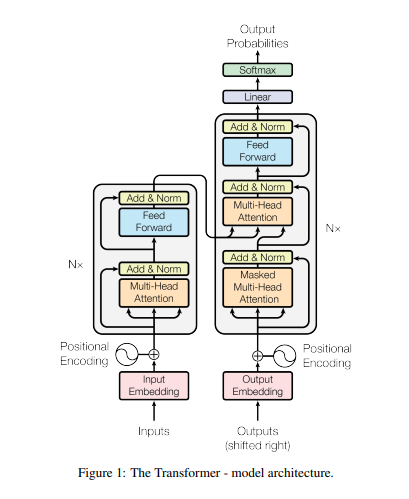

# Attention-Is-All-You-Need
Attention Is All You Need explained
$$
\frac{1}{c} \cdot \int_{1}^8 x^2 dx 
$$

$$
J_{1}^{V}=\left\{W_{1} \in \Omega:\right. \text{Jogador somar 7 pontos}\} \text{ 6 pontos de amostra}
$$
Attention Is All You Need

https://www.youtube.com/watch?v=iDulhoQ2pro

CS480/680 Lecture 19: Attention and Transformer Networks

https://www.youtube.com/watch?v=OyFJWRnt_AY

https://towardsdatascience.com/attention-is-all-you-need-discovering-the-transformer-paper-73e5ff5e0634

http://peterbloem.nl/blog/transformers

Transformer Neural Networks - EXPLAINED! (Attention is all you need)

https://www.youtube.com/watch?v=TQQlZhbC5ps

ver sobre :

- hidden representation

- softmax function

- wordvector

##### Duvidas

- transduction models
- Attention mechanism  - mecanismo para o decoder utilizar as partes mais relevantes do input.
- Transformer is a new simple network architerutem, that dispense recurrent e convolutions
- verificar como são os modelos recorrentes e as convolutions
- Este modelo só serve para  tradução? acho q não! verificar.
- o que é o hidden state

# Resumo

##### Abstract:

Este artigo propos uma nova arquitetura, chamada Transformers, que dispensa o uso de modelos recorrentes e de convoluções.

Em tarefas de tradução este modelo teve uma qualidade superior, alem de ser "mais paralelizável" e precisou de menos treinamento.

Além disso, o modelo se mostrou generalizável para outras tarefas.

##### Introdução

RNN, LSTM and Gated recurrent Neural networks estao estabelecidos como os melhores modelos para trabalhar como problemas com sequencia ou transdução (inferencia), como tradução.

Modelos Recorrentes se baseam na posição do input. Gerando um sequencia de "hidden state". O que impede a paralelização do trabalho de treinamento. Além da utilização severa da memória.
$$
h_t \quad h_{t-1}
$$
Attention mechanism - 

O modelo transformer evita a utilização de recorrencia, ao invés de depender exclusivamente do mecanismo atention para desenhar dependencias globais entre input e output.

Permitindo um aumento significante de paralelização.

#### Background

Para reduzir os calculos sequencias é necessário a utilização de convoluções. Porém o numero de calculos necessários cresce linearmente ou logaritimicamtne. Fazendo o aprendizado ser mais dificil. No Transformer isto é reduzido à um numero constante de cálculos. 

##### Arquitetura do Modelo

