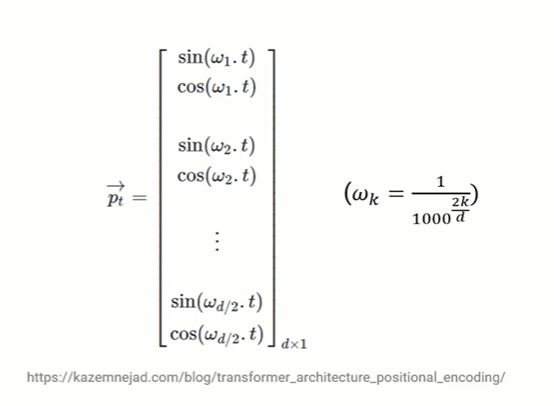

# Attention-Is-All-You-Need
Attention Is All You Need explained -  Mostrou que não era necessário a utilização de RNN.

----

---

# Resumo

##### Abstract:

Este [artigo](https://arxiv.org/pdf/1706.03762.pdf) propôs uma nova arquitetura, chamada Transformers, que dispensa o uso de modelos recorrentes (classificação e tradução de frases pequenas) e de convoluções.

Em tarefas de tradução este modelo teve uma qualidade superior, além de ser "mais paralelizável" e precisou de menos treinamento.

Além disso, o modelo se mostrou generalizável para outras tarefas.

##### Introdução

RNN, LSTM and Gated recurrent Neural networks estão estabelecidos como os melhores modelos para trabalhar como problemas com sequencia ou transdução (inferência), como tradução.

Modelos Recorrentes se baseiam na posição do input. Gerando uma sequência de "hidden state” .  O que impede a paralelização do trabalho de treinamento. Além da utilização severa da memória.

##### Attention mechanism  

O modelo transformer evita a utilização de recorrência, ao invés de depender exclusivamente do mecanismo atenttion para desenhar dependências globais entre input e output.

Permitindo um aumento significante de paralelização.

#### Background

Para reduzir os cálculos sequenciais é necessário a utilização de convoluções. Porém o número de cálculos necessários cresce linearmente ou logaritmicamente. Fazendo o aprendizado ser mais difícil. No Transformer isto é reduzido à um número constante de cálculos.

###### Arquitetura do Modelo
##### Arquitetura do Modelo

A maioria dos modelos transdutores tem uma estrutura encoder-decoder. No transformers o encoder mapeia a sequencia de inputs  para uma sequencia de representação . Dado  , o decoder gera uma sequencia de outputs  um elemento de cada vez.

No transformer a forma de adicionar a informação da posição foi somar o vetor de input embeddings com o vetor de posição.

Critérios necessários para o vetor de posição são:

- Encoder único para cada etapa

- distância consistente entre duas etapas 

- Possibilidade de generalizar para sentenças longas

- ser determinístico

  

  #### Solução

  

  

---

### Mulit-head Attention

#### Self-Attention em detalhe

- **Primeiro passo** criar 3 vetores a partir de cada input (embedding vector de cada palavra). Criamos 3 vetores o Query, o Key e o Value. Esse vetores foram criados a partir da multiplicação de cada matriz obtida no treinamento com o vetor de embedding.

  

- **Segundo passo** calculando o pontuação. Precisamos calcular a pontuação de cada palavra que geralmente vem depois da palavra analisada. Neste exemplo, "Thinking",  será analisado quais palavras tem maiores chance de vir depois dela. O Vetor SCORE é calculado tomando o produto escalar do vetor QUERY com o vetor KEY da respectiva palavra que estamos pontuando. Então, se estivermos processando a self-attention para a palavra na posição #1, a primeira pontuação seria o produto escalar de q1 e k1. A segunda pontuação seria o produto escalar de q1 e k2. 

  **AQUI NÃO FICOU CLARO, QUAL INFORMAÇÃO O VETOR QUERY TEM, SÓ FOI EXPLICADO QUE ELE VEM DA MULTIPLICACAO DO VETOR DA PALAVRA (EMBEDDING) COM UMA MATRIZ QUE FOI OBTIDA NO TREINAMENTO. wtf NESSA MATRIZ?**

  

- **Terceiro e quarto passo** é dividir as pontuações por 8 (a raiz quadrada da dimensão dos vetores chave usados no artigo – 64. Isso leva a ter gradientes mais estáveis. Pode haver outros valores possíveis aqui, mas este é o padrão), então passe o resultado através de uma operação softmax. O Softmax normaliza as pontuações para que sejam todas positivas e somam 1.

- **Quinto passo** é multiplicar cada vetor de valor pela pontuação softmax (em preparação para soma-los). A intuição aqui é manter intactos os valores da(s) palavra(s) em que queremos focar e abafar palavras irrelevantes (multiplicando-as por números minúsculos como 0,001, por exemplo).
- **Sexto passo** é somar os vetores de valor ponderado. Isso produz a saída da camada de *self-atettion* nesta posição (para a primeira palavra)

Isso conclui o cálculo de *self-atettion*. O vetor resultante é aquele que podemos enviar para a rede neural feed-forward. Na implementação real, no entanto, esse cálculo é feito em forma de matriz para um processamento mais rápido. Então, vamos ver isso agora que vimos a intuição do cálculo no nível da palavra.

## Matrix Calculation of Self-Attention

SSDSDSD

___

---

## Feed Forward

São duas transformações lineares com ReLu activation entre elas. O Objetivo é processar o output da camada Atettion de forma que atenda melhor a camada atettion seguinte.	 

ssss

---

#### Referencias:

https://www.youtube.com/watch?v=XowwKOAWYoQ

Attention Is All You Need

https://www.youtube.com/watch?v=iDulhoQ2pro

CS480/680 Lecture 19: Attention and Transformer Networks

https://www.youtube.com/watch?v=OyFJWRnt_AY

https://towardsdatascience.com/attention-is-all-you-need-discovering-the-transformer-paper-73e5ff5e0634

http://peterbloem.nl/blog/transformers

https://www.youtube.com/watch?v=FWFA4DGuzSc&list=WL&index=3

https://www.youtube.com/watch?v=iH-wmtxHunk

explicação de word-embeddins

https://www.youtube.com/watch?v=gQddtTdmG_8

Transformer Neural Networks - EXPLAINED! (Attention is all you need)

https://www.youtube.com/watch?v=TQQlZhbC5ps

aparentemente excelente explicação

https://jalammar.github.io/illustrated-transformer/

http://nlp.seas.harvard.edu/2018/04/03/attention.html

https://github.com/tensorflow/tensor2tensor

https://blog.ml.cmu.edu/2020/03/20/are-sixteen-heads-really-better-than-one/

http://peterbloem.nl/blog/transformers

Transformer Feed-Forward Layers Are Key-Value Memories
https://arxiv.org/pdf/2012.14913.pdf

An Attentive Survey of Attention Models
https://arxiv.org/pdf/1904.02874.pdf

https://kazemnejad.com/blog/transformer_architecture_positional_encoding/

https://timodenk.com/blog/linear-relationships-in-the-transformers-positional-encoding/
---

ver sobre :

- hidden representation

- softmax function

- wordvector

---

##### Duvidas

- [Transduction models](https://machinelearningmastery.com/transduction-in-machine-learning/) -  predicting specific examples given specific examples from a domain
- Attention mechanism  - mecanismo para o decoder utilizar as partes mais relevantes do input. Cuidou do problema dos modelos RNN que só performavam bem em tradução de frases pequenas.
- Transformer is a new simple network architerutem, that dispense recurrent e convolutions
- Como é feito o calculo do self-attetion?
- verificar como são os modelos recorrentes e as convolutions
- Este modelo só serve para  tradução? acho q não! verificar.
- o que é o hidden state
