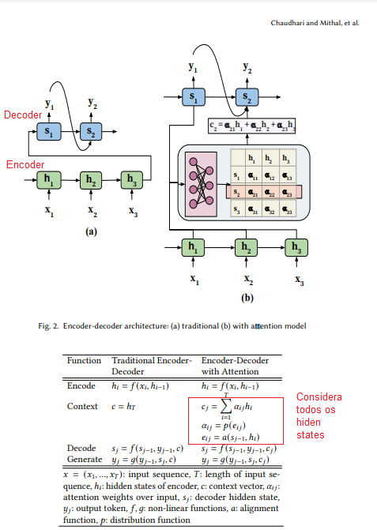
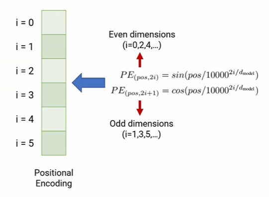
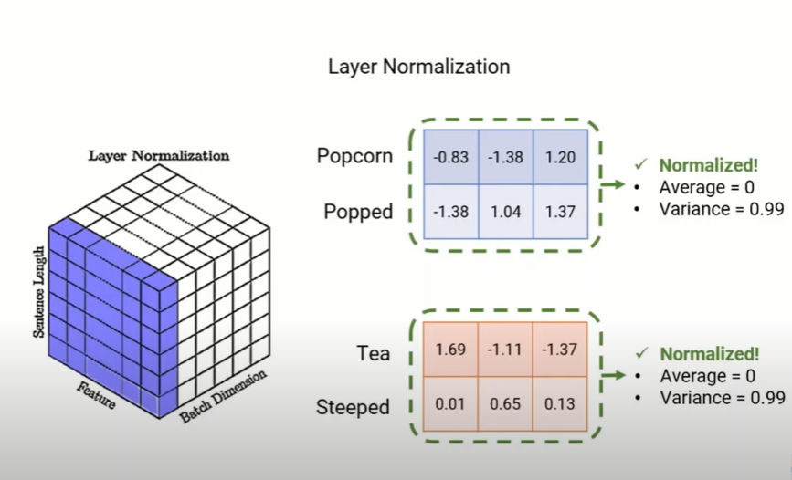
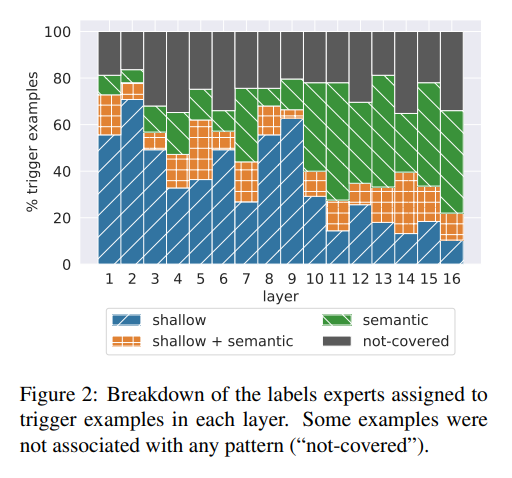
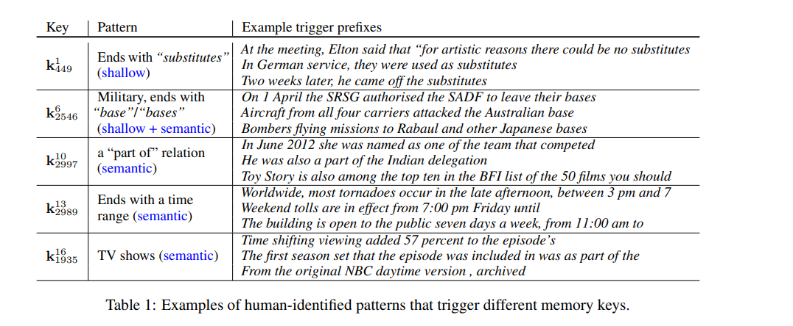
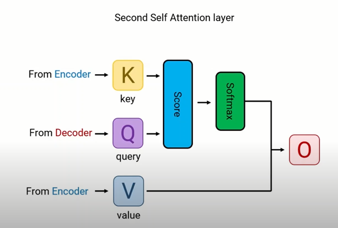

Introdução

Os problemas sequenciais eram resolvidos com RNN e GRNN.

Task como traducao era resolvido com arquitetura de sequencia para sequencia .
Seq2seq sao redes neurais que transformam dada sequencia de elementos, como uma frase, em outra sequencia (exemplo, traducao de texto).

seq2seq models são compostos basicamente por um encoder e um decoder. O encoder pega e sequencia e mapeia uma uma dimensão maior. Este vetor é inserido no decoder que transforma em uma saida sequencial, que pode ser a tradução de uma sentença, por exemplo.

Em 2015 um novo modelo de encoder-decoder com o Attention, para tarefas de tradução. Desde então o mecanismo de Attention, se tornou componente essencial para modeles de sequencia.

Pois ele resolveu umm problema de "perda de memória" para sequencias muito grandes. Pois passou a considerar todos os hidden states e os seus respectivos pesos.

A arquitetura tansformer, proposta no artigo "Attention Is All You Need" não usa processamento sequencial. Mostra que podemos usar apenas o mecanismo "Attention". Permitindo paralelização.

## Detalhes do Modelo

Muitos modelos de transdução eficientes tem estrutura encoder-decoder. O modelo transformer proposto, também tem essa estrutura.

## Encoder

# inputs
 pri
 
# positional encoding
o proposito é adicionar informação de posicao antes de inserir o embedding no encoder. Pois o transformer foi para originalmente para tarefas de tradução, e para essas tarefas a posição da informação é bem relevante.

Os modelos de RNN levam em consideração a posição da informação, já que eles processam a informação sequencialmente. Porém, como essa estrutura foi retirada, deve ser inserido algum mecanismo para considerar a posição da informação e permitir a paralelização. 

Critérios necessários para o vetor de posição são:

- Encoder único para cada etapa

- distância consistente entre duas etapas 

- Possibilidade de generalizar para sentenças longas

- ser determinístico

Solução proposta foi:

Links de artigos que explicam o motivo para usar essa forma de positional-encoding

https://kazemnejad.com/blog/transformer_architecture_positional_encoding/

https://timodenk.com/blog/linear-relationships-in-the-transformers-positional-encoding/

# Multi-head Attention

## self-attention
---
## Add e Norm 

Primeiro calculamos a soma do vetor de output do Attention block e o input Embending Vector. Depois tem uma camada de normalização.
Sabemos que a normalização tem os seguintes benefícios:
- Reduz o viés
- Impede que os pesos divirgam
- Permite um treinamento mais rápido.

- Layer Normalization

Pegamos a media e a variancia de todas as caracteristicas da sentenca. Depois da normalização teremos matrizes com média zero e variancia 1. Este método se mostrou mais eficiente que o bacth normalization. [Para saber detalhes sobre Layer normalization](https://arxiv.org/abs/1607.06450)

---
# Feed Forward

Cada camada do encoder  e do decoder, contém uma camada totalmente conectada, que é aplicada a cada posição separadamente e igualmente. Isto consiste em duas transformações lineares com um ativação ReLu entre elas. O Objetivo principal é processar o output um camada Attention de uma forma que melhor sirva o input para a camada Attention seguinte.
[Detalhes sobre feed-forward layers](https://arxiv.org/pdf/2012.14913.pdf), neste artigo eles encontraram que esta arquitetura era capaz de capturar alguns padrões de caracteristicas linguisticas

feed_forward_caract

Podemos observar na Figura 2 que neuronios nas camadas mais baixas, capturam frequentemente padrões superficiais, enquanto camadas mais altas capturam padrões semânticos.
 - **Exemplos:
 
 
 
Shallows -> vem da propria palavra.
Semantic -> Bases tem significado militar.

---
# Decoder

Decoder pode trabalhar em diferentes modos.

- Modo de Treinamento: Decoder ajusta os parametros da rede.
- Modo de teste: Decoder está fazendo a tradução das sentenças. 

**Decoder em fase de teste: (tarefa de tradução)

 
 Decoder escolhe qual a palavra é a mais provável que seja a tradução mais correta.
 Enquanto o encoder pode ser executado paralelamente, o decoder precisa ser executado de forma serial, pois ele precisa do resultado da previsão para prever o seguinte.
 
** Decoder em fase de treinamento

---
# Masked- Multi-head Attention

mecanismo que esconde as palavras do resultado correto, durante a fase de treinamento para impedir que o modelo tenha o resultado antes de fazer a previsão e o ajustes dos pesos.

[Video of masked self-attention](https://www.youtube.com/watch?v=piT1_k8b9uM)
---
# Keys and Values

Pegamos a saido do encoder, e fazemos duas copias fazendo duas transformações lineares. Uma delas será a Key e a outra será o Value para todo o selfAttention mecanism.
O ultimo ingrediente é a Query vem do decoder. O decoder pega a sentenca objetivo e produz um output
Para o self attetinion.

---
xxxxxxxx
xxxxxxxx

\\
trad_encoder.png